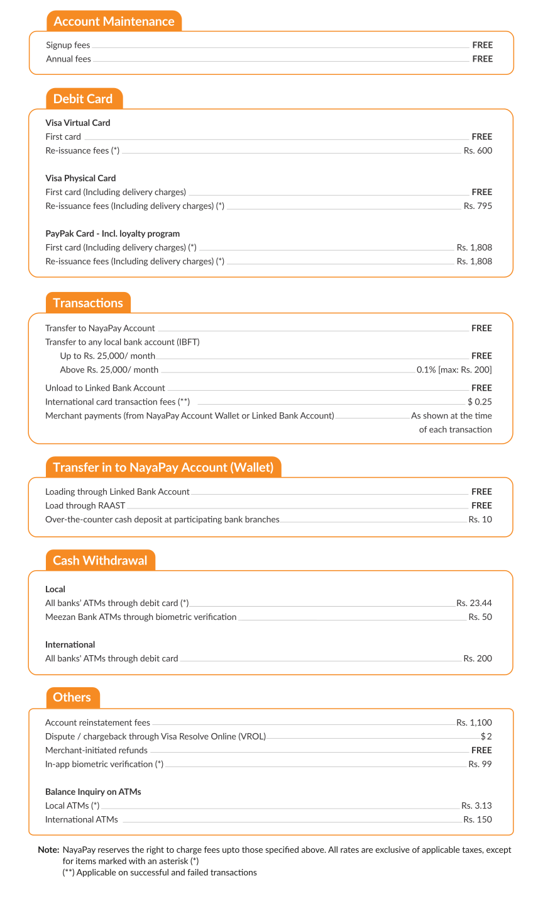

<!DOCTYPE html>
<html>

<head>
    <meta name="viewport" content="width=device-width, initial-scale=1">
    
</head>

<body>

    

        

        

            <a href="#Personal">Personal</a>
            <a href="#Business">Business</a>
            <a href="#Help Center">Help Center</a>
            <a href="#Newsroom">Newsroom</a>
            <a href="#Career">Careers</a>
            <a class="active" href="#Get Nayapay"
                style="margin-right: 80px; padding-left: 35px; padding-right: 35px;">Get NayaPay</a>
        

    

    

        
        <h3 class="soc-title">Schedule of Charges</h3>
        
July - Dec 2023

         
         
        
    

    

        
   

        

        <!-- naya pay and  other logos -->
        

            

                

                

                    
                    
                    
                    
                

            

        

        

            

                

                    <ul style="line-height: 35px; color: black; list-style-type: none;">
                        <li class="footerNavTitle"
                            style="font-size:15.5px; font-family:'Trebuchet MS', 'Lucida Sans Unicode', 'Lucida Grande', 'Lucida Sans', Arial, sans-serif;">
                            <strong>General</strong>
                        </li>

                        <li><a href="/" style="color: black; text-decoration: none;">Personal</a></li>
                        <li><a href="/business" style="color: black; text-decoration: none;">Business</a></li>
                        <li><a href="https://help.nayapay.com/" style="color: black; text-decoration: none;">Help
                                Center</a></li>
                        <li><a href="/news" style="color: black; text-decoration: none;">Newsroom</a></li>
                        <li><a href="/soc" style="color: black; text-decoration: none;">Schedule of charges</a></li>

                    </ul>
                

            

            

                

                    <ul style="line-height: 35px; list-style-type: none; ;">
                        <li class="footerNavTitle"><strong>Connect</strong></li>
                        <li><a href="/careers" style="color: black; text-decoration: none;">Careers</a></li>
                        <li><a href="/contact" style="color: black; text-decoration: none;">Contact us</a></li>
                    </ul>
                

            

            

                

                    <ul style="line-height: 35px; list-style-type: none; padding-left:10px;">
                        <li class="footerNavTitle"><strong>Legal</strong></li>
                        <li><a href="/legal-info" style="color: black; text-align: center; text-decoration: none;">Terms
                                and Conditions</a></li>
                    </ul>
                

            

            

                

                    <ul style="line-height: 35px; list-style-type: none;  text-align: center; padding-left: 25px;">
                        <li class="footerNavTitle"><strong>Certifications</strong></li>
                        <li class="bigscreen"></li>
                        <li class="bigscreen"></li>
                    </ul>
                

            

        

        

            
NayaPay (Private) Limited is authorised and regulated by the State Bank of
                Pakistan as an Electronic Money Institution.

            
 NayaPay © 2023. All rights reserved.

            
Download the app now!

            

                
                
            

        

    

    
   

</body>

</html>
